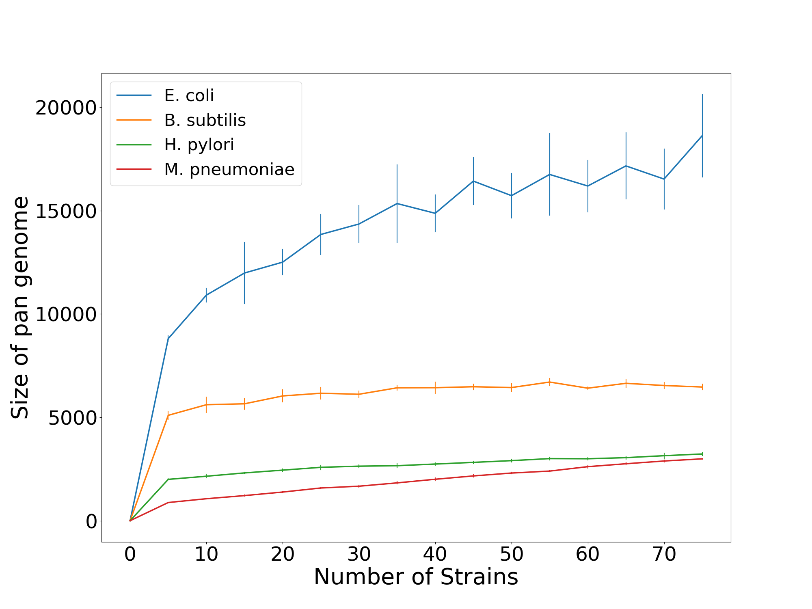
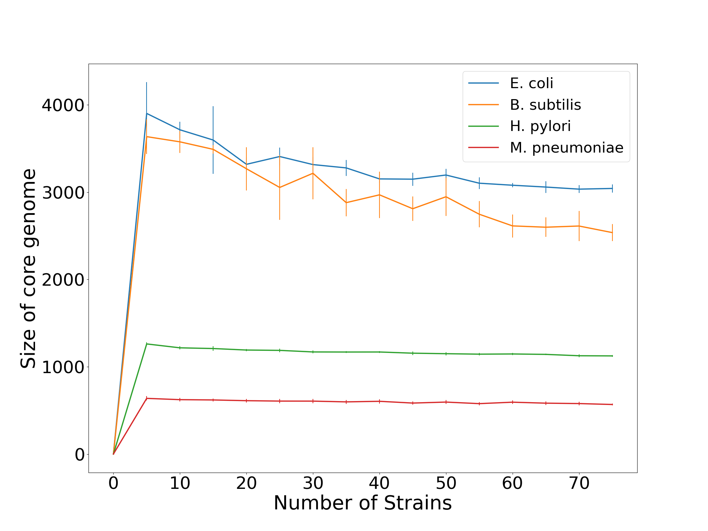

# pango
A bioinformatic pipeline for constructing pan/core genome using python.

### Description

Pango is a bioinformatics pipeline implemented in Python and orchestrated with Snakemake for the construction of pan-genomes and core genomes. It employs an all-vs-all reciprocal BLAST strategy to identify gene homologs across input genomes, providing a robust and sensitive approach to homology detection. As a result, runtime is primarily determined by BLAST computation, which scales with the number and size of input sequences. All auxiliary processing steps are implemented using vectorized pandas operations, ensuring efficient and scalable data handling throughout the pipeline.

### Benchmarking

The pan-genome of a species provides critical insights into its biology and evolutionary history. The environment a species inhabits shapes its population dynamics, which in turn drives modifications to its gene pool. Species occupying a broad range of habitats tend to accumulate a larger repertoire of genes, whereas obligate parasites undergo genome reduction as an adaptation to their specific host niche. Additional factors influencing gene pool composition include effective population size and genetic drift. Consequently, characterising the pan-genome and core genome has become an integral component of population genetics and evolutionary studies.

To benchmark Pango, I selected four well-characterised bacterial species, each represented by more than 90 complete genomes annotated in the NCBI RefSeq database. Two facultative pathogens (Escherichia coli and Bacillus subtilis) and two obligate pathogens (Mycoplasmoides pneumoniae and Helicobacter pylori) were chosen to capture the contrasting trends expected in pan-genome and core genome architecture. Pan-genomes and core genomes were constructed by incrementally sampling from 10 to 90 strains, with five independent random samplings performed at each interval. In a complementary analysis, gene frequency distributions were examined at a fixed strain count. Together, these analyses provide a framework for interpreting the distinct evolutionary trajectories and gene pool dynamics characteristic of each bacterial lifestyle.

<p align="center">
  
  
</p>

### Usage 

**Steps to run the pipeline:** 

1. copy the `codes` folder to the working directory (Ideally a directory for a species). 
2. Make a list of genome accessions to be used.
3. Give necessary permissions to the shell scripts for creating necessary folders.
4. Set up the `config.yaml` file.
5. Set up the conda environment using the `environment.yml` file.
5. Run `make_folders.sh`
6. Run the pipeline using snakemake.

**Snakemake command:**
```bash
snakemake [options] run_pango
```

**Setting up snakemake config.yaml file**

```yaml
# Example config.yaml file
general:
  species_name: B_subtilis
  reference_genome: GCF_000009045.1_ASM904v1
  mol_type: nucl
  species_list: /home/pango/analysis/B_subtilis/B_subtilis.txt
blast:
  num_threads: 1
pango:
  pident: 75
  length_coverage: 75
  evalue: 1e-5
  relaxed_core: 100
```
**Config file options:**
| Variable | Type | Options | Description |
|-------|------|---------|-------------|
| `species_name`       |string||Species name|
| `reference_genome`   |string||Accession for reference genome used in the pipeline. (Does not affect the results)|
| `mol_type` |string|*nucl* or *prot*|Determines the fasta file to be used in pipeline. [nucl: nucleotide / fna, prot: protein / faa]|
| `species_list` |path||Path to the file containing accessions for genome files to be used|
| `num_threads `         |||Number of threads to be allocated for BLAST|
| `pident `         |float||percentage identity to determine homology after running BLAST|
| `length_coverage `         |float||Length overlap to determine homology after running BLAST|
| `evalue `         |float||evalue to determine homology after running BLAST|
| `relaxed_core `         |float||For generating relaxed core genome|

**Restarting the pipeline:**

If you run into any error or need to restart the pipeline, run the `revert_snakemake.sh` script, which deletes all the temporary folders and files created by the pipeline.


### References
1. Dewar AE, Hao C, Belcher LJ, Ghoul M, West SA. Bacterial lifestyle shapes pangenomes. *Proc Natl Acad Sci U S A*. 2024 May 21;121(21):e2320170121.
2. Bobay LM, Ochman H. Factors driving effective population size and pan-genome evolution in bacteria. *BMC Evol Biol.* 2018 Oct 12;18(1):153.
3. Kuo CH, Moran NA, Ochman H. The consequences of genetic drift for bacterial genome complexity. *Genome Res.* 2009 Aug;19(8):1450-4.
4. Tonkin-Hill G, MacAlasdair N, Ruis C, Weimann A, Horesh G, Lees JA, Gladstone RA, Lo S, Beaudoin C, Floto RA, Frost SDW, Corander J, Bentley SD, Parkhill J. Producing polished prokaryotic pangenomes with the Panaroo pipeline.*Genome Biol.* 2020 Jul 22;21(1):180.
5. Page AJ, Cummins CA, Hunt M, Wong VK, Reuter S, Holden MT, Fookes M, Falush D, Keane JA, Parkhill J. Roary: rapid large-scale prokaryote pan genome analysis. *Bioinformatics.* 2015 Nov 15;31(22):3691-3.

**Claude.ai used for paraphrasing this README*